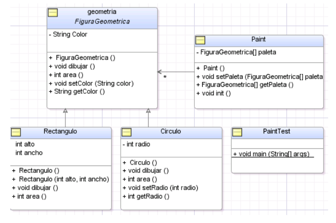

6.- Escriba las siguientes clases java que figuran en el siguiente diagrama UML respetando cada una de las especificaciones para las clases y las relaciones entre ellas:

Tenga en cuenta lo siguiente:

	

- La clase FiguraGeometrica es una clase abstracta con 2 métodos abstractos dibujar() y area() y el resto de los métodos concretos.
- Las subclases Rectangulo y Circulo son clases concretas. Ambas deben implementar el método dibujar() simplemente imprimiendo un mensaje en la consola. Por ejemplo: “se dibuja un círculo de radio 2 y de color azul” (donde el radio y el color son variables de instancia). El método area() debe implementarse en cada subclase de FiguraGeometrica.
- En la clase Paint, el método init() debe crear las instancias de Rectangulo y Circulo y guardarlas en el arreglo paleta. Los valores para crear estas instancias son los siguientes:
    - Defina 2 objetos Circulo (radio 2 y color azul, radio 3 y color amarillo)
    - Defina 2 objetos Rectangulo (alto 2, ancho 3, color verde y alto 4 y ancho 10 y color rojo).
- La clase PaintTest debe crear una instancia de Paint, inicializarla y recorrerla. En cada iteración invoque el método area() sobre el elemento actual y getRadio(), sólo si se trata de un objeto de tipo Circulo.
- Construya un archivo jar ejecutable con las clases anteriores. El mismo debe poderse ejecutar como un programa haciendo doble click.