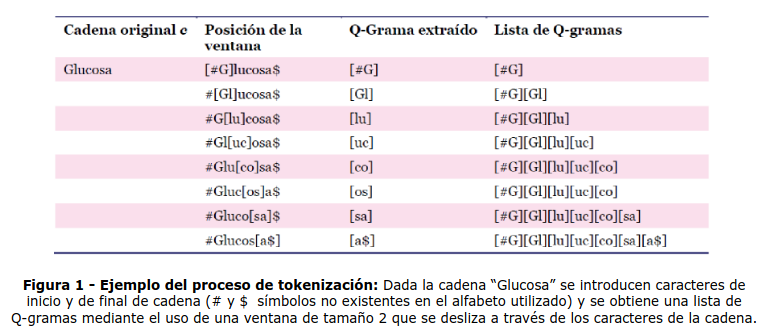

3.- Se desea recuperar colecciones de palabras similares y para ello se deben implementar un motor de comparación basado en una técnica particular de **string matching**. Esta técnica define una función de similitud entre dos cadenas que indicará cuán similares son dichas cadenas.

Las técnicas utilizadas por estos tipos de motores de comparación están basadas en tokenización (descomposición en unidades básicas), y como resultado del proceso obtendremos un conjunto de tokens, o lo que es lo mismo, de Q-gramas (sub-cadenas de tamaño Q). La siguiente figura muestra un ejemplo de tokenización en gramas de tamaño 2:

	

Usted debe:

a) Implementar un diccionario de gramas que almacenará el resultado de la factorización de palabras en Q-gramas, con Q=2, donde las claves del diccionario serán las gramas y el valor almacenado en el mismo serán las listas de palabras que contiene el grama de la clave.

b) Implementar un motor de comparación basado en la siguiente técnica de **string matching**:

○ **Distancia de Levenshtein menor a tres**: Las cadenas comparadas deben poseer una distancia de Levenshtein menor a tres. La distancia de Levenshtein, distancia de edición o distancia entre palabras es el número mínimo de operaciones requeridas para transformar una cadena de caracteres en otra. Por ejemplo, la distancia de Levenshtein entre "casa" y "calle" es de 3 porque se necesitan al menos tres ediciones elementales para cambiar uno en el otro. (<http://es.wikipedia.org/wiki/Distancia_de_Levenshtein>).

El motor de comparación definirá un método que recibirá como parámetro un diccionario de gramas de tamaño 2 y una cadena. Dicho método dividirá la cadena en gramas de tamaño 2, explorará recolectando las palabras almacenadas en el diccionario de gramas que contenga alguno de los gramas de la cadena enviada como parámetro y retornará como resultado la colección de palabras que cumplen con el criterio de comparación.